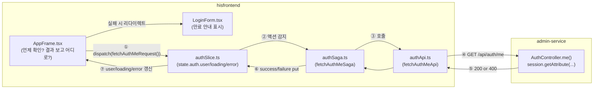
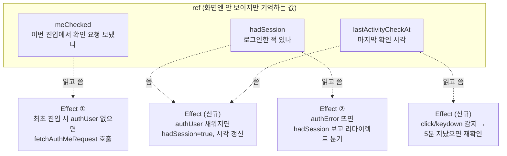
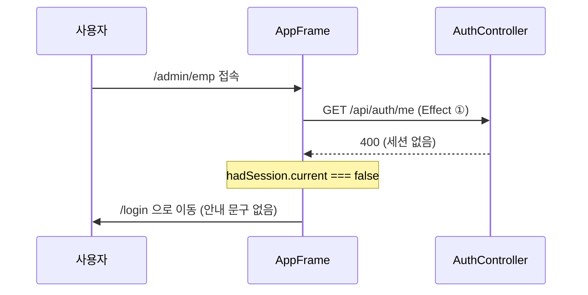
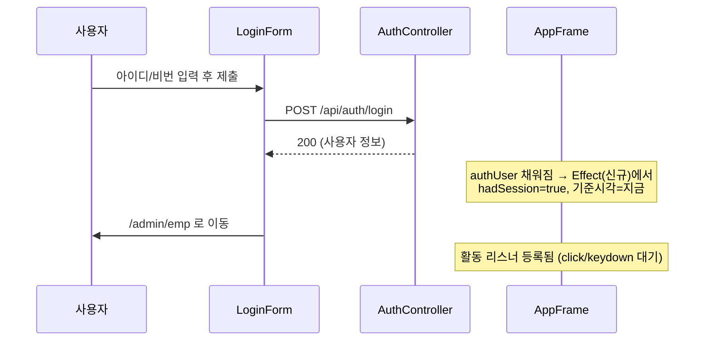
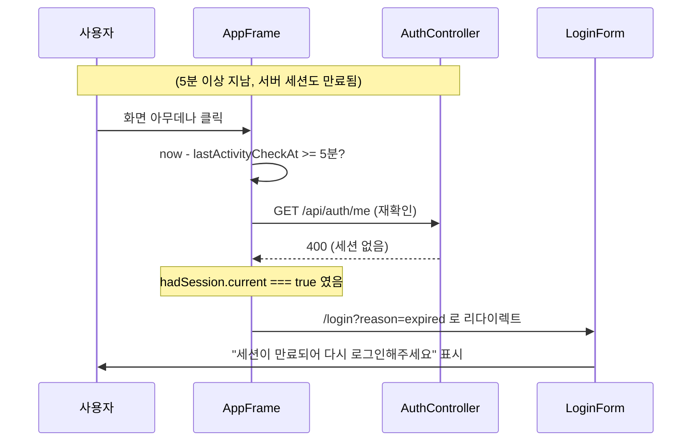
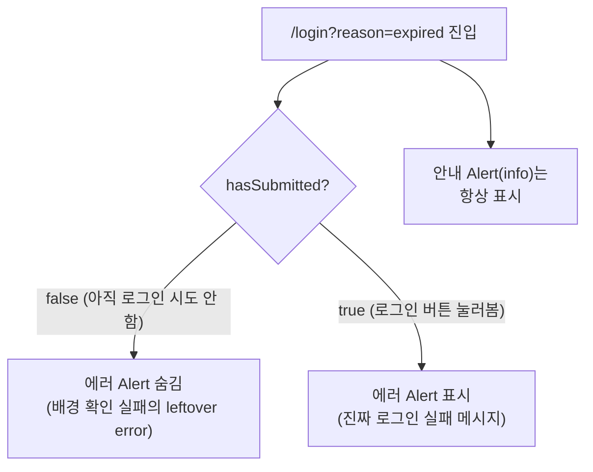

# 세션 만료 처리 (IH2-8) 코드 분석

관련 티켓: IH2-81(재인증), IH2-82(안내 메시지), IH2-83(감지 로직)
건드린 파일: `src/components/layout/AppFrame.tsx`, `src/components/auth/LoginForm.tsx` (BE 변경 없음)

---

## 1. 전체 그림 — 누가 누구를 부르나

`AppFrame.tsx`는 "언제 확인하고, 결과에 따라 어디로 보낼지"만 판단하는 지휘자예요.
실제로 서버에 물어보고 응답을 처리하는 배관공사는 redux 쪽(`authSlice` → `authSaga` → `authApi`)이 담당합니다.

**포인트**: `AppFrame`은 ①번만 하고, ⑦번 결과(redux state)를 `useSelector`로 구독만 해요. ②~⑥번은 AppFrame이 전혀 몰라도 되는 영역이에요.

---

## 2. 파일별 역할 요약

| 파일 | 역할 | 이번에 변경? |
|---|---|---|
| `AppFrame.tsx` | 언제 세션을 재확인할지(활동 기반 5분 스로틀) + 실패 시 어디로 리다이렉트할지 | ✅ 수정 |
| `LoginForm.tsx` | `?reason=expired`면 만료 안내 표시, 로그인 폼 자체 | ✅ 수정 |
| `authSlice.ts` | redux 상태 정의(`user`/`loading`/`error`) + 액션 정의 | 변경 없음 (기존 액션 재사용) |
| `authSaga.ts` | 액션을 가로채서 실제 API 호출 실행 | 변경 없음 |
| `authApi.ts` | 실제 axios로 `GET /api/auth/me` 호출 | 변경 없음 |
| `AuthController.java` (BE) | `HttpSession`에서 로그인 사용자 조회 | 변경 없음 |

---

## 3. AppFrame.tsx 내부 — ref 3개, effect 4개

### Effect별 상세

**① 최초 세션 확인** (`isBare`/`authUser`/`authLoading` 바뀔 때)
- `/login`이면 `meChecked`, `hadSession` 리셋하고 끝
- 보호된 페이지인데 로그인 여부 모르면 `/api/auth/me` 1회 호출

**② authUser 채워질 때 기준값 세팅** (`authUser` 바뀔 때)
- 로그인 성공(폼이든 재확인이든) 순간마다: `hadSession=true`, `lastActivityCheckAt=지금`

**③ 활동 감지** (`isBare`/`authUser` 바뀔 때 리스너 재등록)
- 로그인 상태에서 클릭/키입력 → 5분 안 지났으면 무시, 지났으면 `/api/auth/me` 재호출 + 시각 갱신

**④ 리다이렉트 분기** (`authError` 뜰 때)
- `hadSession.current`가 true → `/login?reason=expired` (쓰다가 만료)
- false → `/login` (애초에 로그인 안 한 상태)

---

## 4. 세 가지 시나리오 (시퀀스 다이어그램)

### 시나리오 1 — 최초 비로그인 방문

### 시나리오 2 — 정상 로그인

### 시나리오 3 — 쓰다가 세션 만료

---

## 5. LoginForm.tsx — 중복 메시지 방지

- `isExpired` = URL의 `reason=expired` 여부 (FE가 스스로 판단, BE ErrorCode와 무관)
- `hasSubmitted` = 이 화면에서 실제로 로그인 버튼을 눌러봤는지 (로컬 state)
- 에러 Alert 표시 조건: `error && (hasSubmitted || !isExpired)`

---

## 6. 검증한 것 (브라우저로 직접 테스트)

- 5분(테스트 시 5초) 안 지나고 클릭 → 재확인 요청 안 나감
- 5분 지나고 클릭 → `/api/auth/me` 재확인 나감 (실측: `performance.getEntriesByType('resource')`로 확인)
- 서버 세션을 직접 무효화 후 클릭 → `/login?reason=expired`로 정확히 리다이렉트
- 리다이렉트 직후엔 안내 문구만, 이후 실제 로그인 실패 시엔 그 에러도 같이 표시

## 7. 스코프 밖 (이번에 안 한 것)

- `/api/auth/me` 외 다른 API에 세션 검사 강제 (BE 보안 필터 체인 — 별도 스토리)
- 만료 직전 화면으로 복귀 (항상 `/admin/emp`로 이동)
- 다중 탭 동기화, 만료 임박 사전 경고
